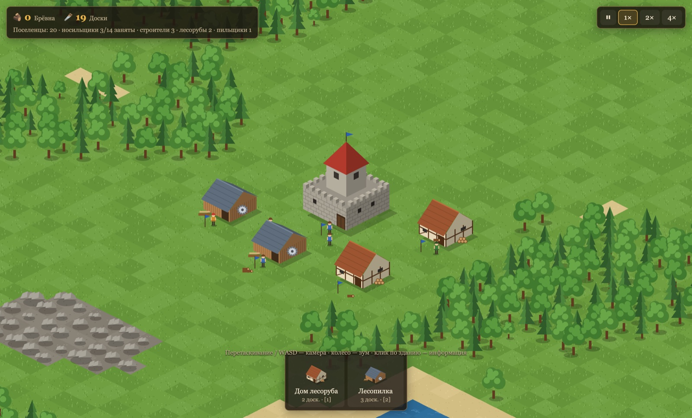

# Settlers — a browser prototype

[Русский](README.md) · **English** · [Deutsch](README.de.md)

A prototype economy strategy game in the spirit of The Settlers 3/4: isometric 2D, sprites, and settlers who fell trees, saw planks and build houses all by themselves. Everything runs in the browser with nothing to install. The interface is available in Russian, English and German (chosen in the settings).



**Play in the browser:** https://dik-garri.github.io/settlersga/ (built and published automatically on every push to `main`).

## System requirements

No installation — just a browser. The game has not been measured on low-end machines, so the minimum below is an estimate.

- **Browser:** a modern one with **WebGL 2** — Chrome / Edge 90+, Firefox 90+, Safari 15+ (practically anything released since 2021). Sound uses WebAudio and starts after the first click. Phones can open the game, but the controls are made for mouse and keyboard.
- **Download:** about 10 MB once (≈ 9 MB art, ≈ 1 MB code), then from the browser cache. Saves live in the browser, ≈ 150 KB per 256 × 256 game.

| | Minimum (estimate) | Comfortable |
|---|---|---|
| CPU | 2 cores (a recent Intel Core i3 / AMD Ryzen 3) | 4 cores or more |
| Memory | 4 GB (the tab needs ≈ 300–600 MB) | 8 GB |
| Graphics | integrated graphics with WebGL 2 (Intel UHD 620, Apple M1, …) | any recent dedicated or integrated GPU |
| Screen | 1280 × 720 | 1920 × 1080 and up (Retina supported) |

Map size and the number of players matter most: 64–128 maps are light, 512 and 1024 are noticeably heavier, especially at 2× / 4× speed. For reference, on Apple Silicon a 256 × 256 map with 1000 settlers computes one game step in ≈ 0.7 ms — about 15 times faster than needed. Only what is on screen is drawn, and far parts of the map are unloaded. **If it stutters:** use a smaller map, avoid 4× speed, try the classic art `?art=classic` (lighter on the GPU) or close other tabs.

## Running it

You need Node.js 20.19+.

```bash
npm install
npm run dev
```

Open the address Vite prints. Every start shows a short intro (a click starts it with sound, another click or any key skips it; it can be turned off in the settings), then the **main menu**, as in Settlers 4 but with its own look and music; behind it lives a settlement that the computer builds by itself:
- **Tutorial** — the first choice, as in Settlers 4: short missions that walk you through the game step by step. The step’s text, the “Next”, “Show” and “Hint” buttons and the list of goals sit in a panel at the top left, the button to press lights up, an arrow marks the place on the map, and whatever the mission has not reached yet is greyed out with a lock in the build menu. All six missions are ready: “Wood and Stone” (camera, goods on the ground, the first buildings: woodcutter, sawmill, stonecutter, forester), “Warehouse, Houses and Carriers” (the warehouse and what it takes in, beds and strikes, priority, stopping, the transport order, the carrier reserve), “Bread for the Miners” (fisher, waterworks, the farm and its work area, mill, bakery, sharing out bread, food for a mine) and “Geologist, Mines and Smithies” (the geologist and his signs, messages and Space, mines on ore, the smelter, ordering tools), “New Land: Pioneer, Market and Donkeys” (the pioneer, cut-off land, markets, the donkey ranch, a route there and back) and “First Battle” against a passive neighbour (the large tower and “Fill up”, ordering fighters by level at the barracks, selecting with a box and with Alt/Shift/Ctrl, right-click orders, a squad under a number key, scouting with a thief or a lookout tower, attack and capture, the infirmary, victory). The step’s mark also blinks on the minimap. Completed missions get a tick; a mission can be saved and continued from the same step. At the end comes a debrief: “Next mission”, “Stay on the map” (free play from there) or “Main menu”.
- **New game** — set up a match: the map size (64–512, default 128 × 128 — Settlers 4's small two-player map; 192 suits three or four players, 320 for more), the map number (empty — random; the same number always gives the same map), starting goods, fog of war and four player slots. Each slot sets who plays it (you, the computer or “Closed”), the people (only the Romans for now; the others will arrive with their races), the team (one team means allies: they do not fight each other, see each other's land and win together) and the computer's difficulty: **Easy** (thinks half as often, attacks later and only with a large advantage), **Normal** or **Hard** (thinks more often, attacks earlier and more boldly, runs more construction sites at once); as in Settlers 4, the computer gets some help — mines that never run dry, extra planks, stone and pioneers (and swordsmen from “Normal” up) at the start, and double army strength from its buildings. The menu remembers your last setup. **Mode**, as in Settlers 4: “Conquest” (the last alliance with manned towers or fighters wins) or “Economic victory”: choosing it draws seven goods at random (you may change them), and after 60 minutes the stock of each held by alliance 1 and by everyone else is compared — every pile on one’s own land: at buildings, in warehouses, at sites and on the ground; ahead in more goods wins, a tie goes to the sum, then to a coin. A conquest before the time is up decides too. Under the panel — the time to the count, in the statistics menu — the comparison by goods, on the end screen — how it was decided.
- **Load** — a list of saves with the date, map size, number of players and time played; any of them can be loaded or deleted.
- **Network game** — up to four players, each in their own browser. One clicks "Create game", gets a six-character code and a link ("Copy" button) and sends it to friends; a friend opens the link (or types the code under "Join") and takes a "Network player" seat. The host chooses the map, starting goods, fog and seats (free ones can go to the computer), everyone their own team; everyone sees the setup at once, along with pings, "Ready" and a chat. When everyone is ready, the host clicks "Start". In the game the players and their pings are shown top right; if someone's browser falls behind, the game waits for it everywhere ("Waiting for …"), and after 30 seconds the host can disconnect that player. Pause works for everyone at once and anyone can set it (P); only the host changes the speed. A player who leaves (closed the tab or lost the connection) is replaced by the computer; if the host leaves, the game ends — you can save it and continue later with a new host. The game has a chat (Enter or the "Chat" button): to everybody or to the allies only, with the lobby's lines in it. Any player can save a network game (at most once a minute): it is saved on every machine at once, at the same turn, and so is the autosave; it is loaded in the lobby with "Load a network game": whoever lacks the save gets it from the host, and a seat nobody came for goes to the computer or stays without a master, as the host decides. If the connection breaks or the tab is reloaded, you can come back by the same link: while the player is away the computer plays the seat, the host clicks "Let in", and the player goes on from their seat. The game fits the order delay to the connection by itself: longer on a poor one, so that it does not stall, shorter on a good one. Browsers connect directly (WebRTC, introduced by the free PeerJS server), so players see each other's IP addresses; everyone needs the same version of the game. Should the games ever go out of sync (they should not), the game stops with a "The game went out of sync" window — its report helps to find the bug. It also offers the **“Co-operation”** mode (all humans in one team against the computers) and, as in Settlers 4, the **saboteur**.
- **Settings** — language (Russian, English, German; it switches at once, both in the menu and in a game — by default the browser's language if it is English or German, otherwise Russian), sound, music, art style (3D or classic), and whether to show the intro at start-up (yes by default); **About**; **Exit** — back to the intro. From inside a game, “Exit” goes straight to the main menu.

**In a game**, Esc (when nothing is selected) or “Menu” on the Options page of the left panel opens the game menu and pauses the game: “Continue”, “Save” (a new save with a name, or overwrite an old one), “Load”, “Settings”, “Quit to main menu”. You can have as many saves as you like; they are compressed and kept in the browser, and every 5 minutes of play the game saves itself to the “Autosave” slot.

For development, a game can be started straight away, bypassing the menu, with URL parameters (`?menu` opens the menu anyway). The map is generated at random; to play the same map again, add `?seed=42` to the address (the current map's seed is printed in the browser console). The map size is set with `?size=192` (default 128; maps up to `?size=1024` are playable), the number of players with `?players=1` (default 2: you and a computer opponent in the opposite corner of the map; `?players=4` — you and three computer opponents, better on large maps). With `?teams=1,1,2,2` the players are split into teams: allies do not attack each other, win together and see everything an ally sees (shared fog of war). `?levels=medium,hard` sets the computer's difficulty per player, `?load=1` loads the latest save, and `?tutorial=forest` opens a tutorial mission straight away (`forest`, `logistics`, `bread`, `metal`, `trade`, `battle`; `&step=3` starts at the third step). `?lang=en` (or `de`, `ru`) opens the game in that language without changing the choice in the settings. With `?ai=off` the opponents stay passive, and `?fog=off` turns the fog of war off (for debugging). For development there is a demo map, **`?demo`** (for example https://dik-garri.github.io/settlersga/?demo): it builds itself up in a couple of seconds and shows everything at once — every building finished and staffed, construction sites frozen at each stage, piles of every kind of goods, a geologist out prospecting with a field of his signs for every ore, a pioneer at the border and a thief at player 2's warehouse, a squad round its squad leader, donkeys between markets, the wounded at an infirmary, every decoration; without fog (`?fog=on` — with fog). By default all the graphics are in the Settlers 4 style, made in Blender (`?art=classic` — the old art, drawn by code): ground of every kind (beaches, water, mountains, desert, swamp), conifers and broadleaf trees, tufts of grass, flowers and mushrooms in the meadows, fields and paths, every building (with construction stages: stakes, a frame or foundation, walls, roof), stones, piles of every kind of goods at the doors (you see as many as there are; more than eight and the next pile starts beside it), every settler and soldier (3D figures in a tunic of the player's colour, carrying the tool of their trade). The soldiers are dressed as Roman legionaries and stand out from civilians at a glance: the swordsman wears a steel helmet and banded armour and carries a large curved shield in the player's colour, the bowman wears a helmet and leather armour and carries a quiver, and the squad leader is all in gold: a gilded helmet with a tall crest, a cuirass, a round golden shield and a cloak.

## How to play

As in Settlers 4, there is no headquarters: you start with a single guard tower (one swordsman inside; the other starting fighters stand free next to it, and each new tower calls one of them in) and the Roman people of Settlers 4 — on “Normal”, 32 carriers, 5 builders, 5 diggers, 10 swordsmen and 4 bowmen, 3 geologists (waiting for orders), 2 smiths and 4 miners (they wait for their workshop and mine and take them first, without a tool from storage; a smith will go to either the tool smithy or the weapon smithy); on “Few” — 16 carriers, 3 builders and 3 diggers, 6 swordsmen, 2 bowmen, 2 geologists, a smith and 2 miners; on “Plenty” — 50 carriers, 2 builders and 2 diggers (the stacks hold enough hammers and shovels for a couple of dozen more), 12 swordsmen, 6 bowmen, 5 geologists, 3 smiths, 6 miners, a hunter and 3 donkeys. The goods lie on the ground round the tower in stacks of up to 8 — the same stacks the Romans get in Settlers 4: on “Normal”, 27 planks, 27 stone, 7 shovels, 8 hammers, 5 axes, 4 pickaxes, 2 saws, a fishing rod, a scythe, and a little fish, bread, meat, coal and iron ore. Carriers take them straight off the ground to construction sites and workshops; only what a warehouse accepts is taken into storage. As in Settlers 4, the starting goods can be chosen: “Few”, “Normal” (the default) or “Plenty” — on the “New game” screen of the main menu (where you also set the map size, opponents, allies and difficulty) or with the `?start=low|medium|high` parameter. Every player gets the same guaranteed resources: near the start there is a grove, two quarries, a pond and a mountain with coal and iron, and a little further out, beyond the start tower's border (you need another tower), a mountain with stone, gold and more coal. So gold and fighter levels are available on maps of any size.

Buildings are grouped into tabs of the construction menu:

| Tab | Building | Cost | What it does |
|---|---|---|---|
| Settlement | Small / medium / large house | 3🪚 3🪨 / 5🪚 6🪨 / 10🪚 12🪨 | Gradually releases 10 / 20 / 50 new carriers (as in Settlers 4, on any map). This is the only way the population grows |
| | Warehouse | 3🪚 2🪨 | Storage, as in Settlers 4: 8 piles of 8 units each (64 items; one good may take up several piles, and there is no room for a ninth kind). As in Settlers 4, a new warehouse **accepts nothing** until you tick goods in its window. Surplus goes to the nearest warehouse that accepts it and has room |
| | Pioneer | command | A specialist with a shovel (ordered in the “Settlers” menu). Click unclaimed land: he walks there and claims the unclaimed tiles around him one after another (nearest first, closer to the spot you ordered), until nothing is left within his reach (≈ 5 tiles) — land grows without a tower, and you can even claim a separate island. Then he stays where he is and waits for orders, as in Settlers 4. As in S4 he also moves the enemy's border stones where no tower protects them: an enemy tile right on the border that no tower's influence reaches he claims too; an ally's land he leaves alone. His land has no tower influence, and a foreign tower that covers it takes it |
| Raw materials | Woodcutter’s hut | 2🪚 2🪨 | Fells mature trees within 7 tiles |
| | Forester’s hut | 3🪚 1🪨 | Plants trees within 4 tiles. As in Settlers 4, forests do not spread by themselves: without foresters a felled forest will not come back (roughly one forester for every two woodcutters) |
| | Sawmill | 3🪚 4🪨 | Log → plank |
| | Stonecutter’s hut | 2🪚 3🪨 | Quarries stone from boulders within 7 tiles; stone runs out |
| Food | Waterworks | 3🪚 3🪨 | Draws water from the shore (water never runs out) |
| | Fisherman’s hut | 3🪚 2🪨 | Catches fish from the shore within 7 tiles. As in Settlers 4, fish run out (they do not breed in the water), and every third attempt fails: the fisherman comes back empty-handed |
| | Hunter’s lodge | 3🪚 3🪨 | A hunter with a bow stalks deer within 7 tiles of the lodge and brings back meat. As in Settlers 4, new deer are born by trees with no other animals nearby |
| | Grain farm | 6🪚 6🪨 | Sows as many fields around itself (within 4 tiles) as will fit and harvests the ripe grain. As in Settlers 4, a field ripens in 3.3 minutes and does not spoil, and after the harvest stubble stands for a minute where nothing can be sown; fields are not sown on steep slopes |
| | Mill | 6🪚 3🪨 | Grain → flour |
| | Bakery | 4🪚 5🪨 | Flour + water → bread |
| | Pig farm | 6🪚 6🪨 | Feeds pigs on grain and water (≈ 30 s); as in Settlers 4, a pig is added 3 times out of 4 |
| | Slaughterhouse | 4🪚 4🪨 | Pig → meat (one slaughterhouse keeps up with three pig farms) |
| Mining | Coal mine / iron mine / gold mine / stone mine | 4🪚 1🪨 (gold — 5🪚 1🪨) | Built only on a mountain. As in Settlers 4, every mine has a favourite food (coal and stone — 🍞, iron — 🥩, gold — 🐟): it gives 10 mining attempts, any other food only 2. Each attempt is a random tile within 2, as in Settlers 4: a tile without this ore is a miss and the attempt is wasted (so place the mine right on the vein, going by the geologist's signs); while a tile holds 4 units of ore or more, mining is certain, on a poor tile it is down to luck. A worked-out mine still eats. When the ore runs out, the mine is worked out |
| | Geologist | command | Ordered in the “Settlers” menu (a carrier takes a hammer and waits for orders, like the pioneer and the thief). Click a mountain — your own, unclaimed or foreign: the nearest free geologist goes there and puts up a sign on a stake on every mountain tile showing what he found — lumps of coal, brown lumps of iron ore, gold bars, white blocks of stone, one, two or three of them depending on the amount (a blank board — nothing); after 4–9 minutes the signs come down, but what was found is remembered, and the geologist may put them up again, moving from tile to tile until no unexplored mountain is left nearby (≈ 10 tiles) — the whole ridge. Then he stays where he finished and waits for orders, as in Settlers 4. If no geologist is free, a carrier with a hammer from storage becomes one (the order grows by one) |
| Metalwork | Iron smelter | 4🪚 6🪨 | Iron ore + coal → iron |
| | Gold smelter | 4🪚 6🪨 | Gold ore + coal → gold |
| | Tool smithy | 3🪚 5🪨 | Iron + coal → tool. Forges whatever buildings are waiting for and keeps 2 of each in stock; otherwise it stands idle |
| Military | Weapon smithy | 5🪚 7🪨 | Iron + coal → sword, bow or armour (for the squad leader): first what the barracks' orders are waiting for, and beyond that it keeps 3 of each in stock — in the proportions you set in the “Army” menu (the “−”/“+” buttons by each kind; 60 / 40 / 8 by default) |
| | Barracks | 4🪚 5🪨 | The only source of new fighters and, as in Settlers 4, **only by your order**: in the barracks window or the “Army” menu, order swordsmen, bowmen (levels 1–3) or squad leaders — “+1”, “+5”, “∞” (without end), “−”, “✕”. Without orders the barracks recruits nobody. Once a second it takes the highest-level order for which its pile holds the weapon and the gold (level 2 — +1 gold, level 3 — +2, a squad leader — armour, a sword and 3 gold), calls the nearest free carrier, and he comes out as a fighter and **stays standing by the barracks**. If there is no free carrier, you get a message |
| | Guard tower | 3🪚 2🪨 | Slots: 1 swordsman and 2 bowmen; when finished it calls in one fighter, more with the “Fill up” button; while at least one is inside, it extends your land by 10 tiles |
| | Large tower | 7🪚 7🪨 | Garrison: 3 swordsmen and 3 bowmen, land within 11 tiles |
| | Castle | 8🪚 12🪨 | Garrison: 4 swordsmen and 5 bowmen (like the castle in Settlers 4), land within 12 tiles |
| | Lookout tower | 2🪚 2🪨 | Sees 17 tiles; no garrison and no land. As in Settlers 4, a watchman moves in; while he is at his post, the tower raises the **alarm** — the message “enemy nearby!” when an enemy fighter comes within 11 tiles (once, until the enemy leaves) |
| | Thief | command | A specialist without a tool (ordered in the “Settlers” menu). As in Settlers 4, the thief takes one item at a time from the first pile near the spot he was sent to (at the door of a foreign building — its goods, stock, construction materials or items on the ground; on your own land — only items on the ground, so he moves your goods around) and puts it down at his “home point” — where he became a thief, or where you last sent him on your own land; your carriers will pick it up. He is in disguise: any enemy fighter who comes right up to him unmasks him (on any land; towers do not notice him), and he puts his disguise back on on his own or unclaimed land when no enemies are near. Swordsmen will cut down a thief exposed on their land |
| | Saboteur | command | Network games only, as in Settlers 4. A specialist with a pickaxe (ordered in the “Settlers” menu). Sent at an explored enemy building (finished or a site), he takes a builder’s spot — no more saboteurs on a building than it has builders — and hacks at its walls, one hit point a blow, until it collapses and burns; then he goes for the nearest enemy building close by. He is in disguise like the thief, without the thief’s far sight; his first blow gives him away, and the owner’s swordsmen will cut him down |
| | Infirmary | 3🪚 3🪨 | The healer's house, as in Settlers 4: while the healer is inside, he calls wounded fighters to the door — yours and your allies' that stand idle outdoors (free or as a squad in the field) within 8 tiles of the infirmary (the area can be moved, as with a woodcutter) — and heals them one at a time back to full health. He does not take the wounded out of towers: withdraw them (“Withdraw”) or post a squad nearby. Without an infirmary the wounded are not healed |
| Trade | Marketplace | 2🪚 4🪨 | The start and end of donkey caravans: markets are numbered (“Market #1”, “Market #2”…); in a market's window pick the destination market by number — the distance in tiles is shown beside it, and on the map the route appears as a dashed line with arrows in the player's colour (bright for the selected market, faint for your other routes); below — as in a warehouse — two lists, “Carried” and “Not carried”: a click on a good moves it to the other list. Carriers bring goods to the market, and donkeys take them across any land to the other market; a good taken off the route is no longer carried: carriers already on their way with it turn towards a warehouse, and whatever is waiting at the market goes back there as well. If “Carried” is empty, the market carries nothing |
| | Donkey ranch | 6🪚 6🪨 | Feeds donkeys on grain and water; as in Settlers 4, a donkey is added one time in four. It breeds while there are fewer than three donkeys per market |
| Decoration | Flowerbed / column / statue / fountain / obelisk | 1🪚 1🪨 / 3🪨 / 4🪨 1 gold / 5🪨 1🪚 / 6🪨 2 gold | For beauty and strength: as in Settlers 4, the materials in decorations count triple towards the value of your settlement, and that is what army strength on foreign land depends on |

**Tools.** Most professions need their own tool: the woodcutter an axe, the sawyer a saw, the stonecutter and the miner a pickaxe, the farmer a scythe, the fisherman a fishing rod, the builder a hammer, the digger a shovel, the butcher an axe, the hunter a bow; the forester needs no tool, and the geologist, the pioneer (shovel) and other ordered workers put their tool down on the ground next to them when dismissed (as in Settlers 4) — it will be picked up from there. A carrier first fetches the tool (from a warehouse, from the pile at a workshop or from a stack on the ground) and only then becomes a worker; with no tool, the building waits (this shows in the building's information). At the start the tools lie on the ground by the tower; after that the toolsmith makes them. The toolsmith forges whatever is missing by himself, and in his window you can order the tool you need: +1, +5 or “∞” (forge without end) — orders are forged first.

**Workers and distribution (the “Settlers” and “Goods” menus in the left panel).** As in Settlers 4, builders, diggers and specialists (geologists, pioneers, thieves) do not appear by themselves: the player orders as many as needed (+1 / +5), and that many carriers take up a hammer or a shovel; “↩” turns an idle one back into a carrier; if you lower the order for builders or diggers, the extra ones also become carriers as soon as they are free, putting their hammer or shovel down on the ground. Above that is the **carrier reserve** (5 by default, as in Settlers 4): while there are no more carriers than the reserve, none of them becomes a worker, builder, digger, specialist or recruit — somebody has to do the carrying. The “Goods” menu holds the distribution of goods: for grain, water, coal, iron and the miners' food you can set what share each kind of building gets (for example, all the grain to the mill and none to the pig farm). In a warehouse window the goods are laid out in two lists — “Accepts” and “Refuses” — as large icons with their stock; a click on a good moves it to the other list, and the “all” / “none” buttons move them all at once. The “Transport” page of the “Goods” menu holds the **transport order**, as in Settlers 4 (Roman by default: plank, stone, log, iron, ore, coal, food…): when carriers are short, goods higher on the list are moved first; the arrows move a good one place up or down, or to the top or bottom. Carriers already bringing a warehouse a good it no longer accepts turn towards the nearest warehouse on the same land that accepts it and has room (if there is none, they deliver it anyway, so nothing is lost).

**Beds and strikes.** As in Settlers 4, every carrier needs a bed: you start with 30 / 50 / 60 of them (Few / Normal / Plenty), and every finished house adds as many beds as the residents it releases (10, 20, 50). Workers, specialists and fighters need no bed. If there are more carriers than beds (for example, a house was demolished or its land burnt), the surplus free carriers **go on strike**: they stand about and take no work at all. The “Settlers” menu shows “Beds (carriers)” and how many are on strike, and a warning appears in the message ticker; a new house takes in the strikers first (and releases that many fewer new residents).

**Out of work.** As in Settlers 4, the worker of a demolished or burnt building does not become a carrier: he remains a woodcutter, miner and so on, with his tool, and waits by the houses, and a new building of his trade takes him first — without needing a new tool. How many there are is shown in the “Out of work” row of the “Settlers” menu. A worker cannot be turned back into a carrier (nor can he in Settlers 4 — only specialists can).

**Stopping a building.** The “⏸ Stop” button in the window of a workshop, gatherer, mine, farm, barracks, warehouse, market or construction site, as in Settlers 4: the building finishes the work it has begun and then does nothing and orders nothing, and carriers take the goods at its door to wherever they are needed (or to a warehouse); a construction site releases its builders and diggers and gives its materials to other sites; a warehouse stops accepting goods but still hands out its own; donkeys heading for a stopped market turn back to the market where they were loaded and unload there. A pause badge shows over the roof of a stopped building (over the current stage of a site); “▶ Resume” puts everything back as it was. Houses cannot be stopped.

**Warehouses are not bottomless.** As in Settlers 4, goods in a warehouse lie in piles of 8, and a warehouse has 8 piles (64 items). A new warehouse at first accepts nothing: its window has two lists, “Accepts” and “Refuses”, and a click on a good moves it to the other list. The window shows how full it is: “Filled 40 / 64”, “Piles 5 of 8”, and for each good its count and how many piles it takes. A carrier is sent only where there is already room for his load (items on the way count too), so carriers spread out over different warehouses. When there is no room anywhere on your land, surplus stays with the producer: its pile at the door grows to 8 and it stops — as in the original, until you build another warehouse or consumers take the goods (they take them straight from the producer). An item already in a carrier's hands (say, if his construction site was demolished) is not lost: he puts it down on the ground where he stands, and it will be picked up later like any stack.

**Goods on the ground.** Stacks on the ground (the starting goods, the remains of demolished and burnt buildings, dropped loads) hold up to 8 units of one good per tile. They do not block walking (settlers only walk round them when they can: as in Settlers 4, a path through a stack costs more than twice as much), but nothing can be built or planted on that tile until the stack is cleared. A stack belongs to whoever owns the land: only that player's carriers take it — to construction sites and workshops, and into storage only if some warehouse accepts that good. **Demolishing**, as in Settlers 4, gives back half a building's planks and stone (for an unfinished one, half of what has been built in), and everything that lay at the building (its piles, a warehouse's stock, a site's unused materials) stays on the ground in full. Enemy buildings on captured land burn down without returning any materials, but their goods stay lying there — and are yours.

The economy runs itself: carriers bring materials to construction sites and raw materials to workshops, and take surplus to warehouses that accept it (while there is room). As in Settlers 4, free carriers do not hide in warehouses but stand in small groups by the warehouses and houses (by the tower while there are none), stroll about and chat in pairs — and set to work as soon as there is any. Raw materials needed by buildings of different kinds are shared equally between the kinds — grain between the mill and the pig farm, for example (bread, as in Settlers 4, goes 85 % to coal mines by default and the rest equally to the others) — unless set otherwise under “Goods” → “Distribution”; among buildings of one kind, as in Settlers 4, the one with the smaller pile and the nearer source gets served first, and finished workshops before construction sites. As in Settlers 4, goods are taken from the producer itself first (its pile counts as half as far away as a warehouse), and surplus goes to a warehouse once more than one unit has piled up at the producer. Houses release residents while a player has fewer than 2500 settlers (with five or more players, 10000 shared by all). Where settlers walk often, the grass is trodden into a **path**, then into a **road**: carriers and donkeys walk faster on them (as in Settlers 4; everyone else as on grass), and without traffic they grow over again. The pace of the game matches the original: walking, construction, workshops and gatherers take the same number of seconds as in Settlers 4 (a woodcutter brings in about one log a minute, a sawmill saws a plank in 19 seconds) — see the table in [docs/TIMINGS.md](docs/TIMINGS.md) (in Russian). The world's proportions are like S4's too: our tile is three times as long as an S4 tile, so settlers move at a walking pace — about half a tile a second — and building costs, land radii and work radii are taken from S4, converted to our tile ([docs/PROPORTIONS.md](docs/PROPORTIONS.md), in Russian). A finished building is taken over by a free carrier who becomes its worker, so new buildings need houses.

**Your own land, donkeys and the market.** As in Settlers 4, carriers carry goods only across their own land: between buildings on one connected piece of territory — and on the way they do not cut across foreign or unclaimed land (builders, diggers and workers walk the same way). If the land is split (an outpost beyond foreign or unclaimed land, a captured tower far away), carriers will not deliver anything to the cut-off piece — such buildings are marked with a broken-road badge, and their window says “cut off from the warehouses”. Donkeys carry goods there: build a market on the main land and a market on the cut-off piece, set the route and click the goods you need into the “Carried” list — donkeys from the donkey ranch will carry two packs of 8 each (16 of one good or 8 each of two; a donkey waits for a full load while the goods are still being brought), and on arrival the carriers there distribute them (if there are none, a carrier will move over by himself). Once unloaded, a donkey, as in Settlers 4, goes back to where it was hired if that is on the same land.

**Soldiers and combat.** There are two kinds of fighter: the swordsman (sword, a sturdy close-combat fighter) and the bowman (bow, shoots from 3 tiles away, 6–7 from a tower, but is weaker and strikes less often). As in Settlers 4, the slots in military buildings are split by kind: a tower has 1 swordsman and 2 bowmen, a large tower 3 and 3, a castle 4 and 5; a swordsman will not take a bowman's slot, nor the other way round. **Garrisons work as in Settlers 4:** a finished tower calls in **one** free fighter by itself (a swordsman, or a bowman if no swordsman is free); the other slots are filled by your order. The tower's window shows how many fighters of each kind are inside and how many are wanted; “⬆ Fill up” calls fighters into every slot, “−”/“+” by the swordsmen and bowmen change the number one at a time (no fewer than one fighter in the tower), and “⬇ Withdraw” keeps one while the rest come out one by one — and only while no enemy is near. A fighter you sent into a tower yourself is kept there. A tower calls in any of your fighters outdoors — as in Settlers 4, including those standing by your order or marching to attack (except those in a fight) — higher levels first, nearest first (up to ≈ 7, then 13, then 27 tiles). If there are none free, the tower stands empty, does not hold its land, and you get the message “stands empty: no free fighters”. Fighters never move from tower to tower by themselves. At the start (“Normal”) a swordsman sits in the guard tower and the other 13 fighters stand free beside it. Free fighters stand wherever they happen to be (new ones by the barracks) and attack enemies nearby by themselves. Only the barracks trains new fighters: without it, and without orders, swords and bows just lie there.

**Defence.** Every military building has a garrison minimum that is never touched: those fighters never go on the attack (a castle keeps 3, a large tower 2, a tower 1). As in Settlers 4, a manned tower has a sturdy gate (50 points, slowly repaired): attackers must break it first, and only then do the defenders come out to duel. Defenders are stronger in that they fight at full strength on their own land (see “Army strength”), and garrison bowmen, out of reach themselves, shoot 6–7 tiles at any enemy on your land or unclaimed land (but not at an enemy standing on his own land), 1 stronger from a tower, and 2 stronger against enemies right at the door. The wounded are healed only at an infirmary.

**Levels.** As in Settlers 4, a fighter's level is ordered at the barracks and never changes afterwards: level 1 is just the weapon, level 2 costs 1 gold more, level 3 2 gold more (the barracks orders the gold itself while there are orders above level 1). Higher levels that there is gold for are recruited first, and swordsmen and bowmen of one level take turns; the usual trick, as in S4, is “∞” on level 1 and level 3: level 3 when there is gold, level 1 otherwise. Health and damage by level are as in Settlers 4: a swordsman has 100 / 150 / 210 health and deals 10 / 14 / 20 a blow, a bowman 75 / 120 / 160 and 4 / 6 / 8 a shot; the level shows on the helmet: at level 1 the helmet has no crest, at level 2 a small red crest, at level 3 a large one (in the old `?art=classic` art — chevrons above the head), and the garrison by kind and level is shown in the building's information. A selected fighter has a frame above him with a health bar (green → yellow → red) and level pips; wounded fighters in a fight show it even when not selected. Combat is as in Settlers 4: there are no misses, each of the two strikes at his own pace (a swordsman every 0.9 s, a bowman every 1.4 s), and damage is multiplied by the army strength where the fighter stands; a duel between two level-1 swordsmen lasts about 9 seconds, and a level-3 swordsman beats a level-1 one taking no more than five blows. When someone dies — a fighter, a settler or a donkey — a bright puff in the player's colour slowly rises above him and hangs in the air for three or four seconds before fading away.

To attack, click an enemy military building: its information shows the number of defenders and how many of your fighters within 30 tiles can be sent — free ones and those in formation nearby, then the spares of your military buildings (and who will go: swordsmen and bowmen mixed); choose the number with “−”/“+” and press “⚔ Attack”. The attackers first break the gate, then the swordsmen fight the defenders one at a time while the bowmen support them with arrows; when no defenders are left, your swordsman or bowman takes the building — **one goes in**, the rest stay outside — the building and its land become yours, and foreign civilian buildings that end up on your land burn down (their goods stay on the ground and are yours). Their inhabitants, left homeless on foreign land, flee towards their own; if they do not find it within four legs, they die. Contested land between military buildings goes to the nearest one.

**Direct control.** As in Settlers 3/4, you can command fighters directly: free ones stand by the barracks and the towers (and spares can be brought out of a tower with “⬇ Withdraw” or “−”). Drag a box round your fighters (left mouse button) or click one; as in Settlers 4, Ctrl+click adds to the selection, Shift+click takes all fighters of that kind nearby, Alt+click — in the whole sector, a double click — on the screen, and Backspace keeps only the wounded in the selection. The selected fighters are ringed in green, and the left panel shows the “Squad” window: how many fighters of each kind and level there are, their health, and the buttons “Hold”, “To garrison” (each into the nearest of your military buildings with a free slot of his kind) and “Deselect”. A right click gives an order: on the ground — line up there in formation (each walks to his own spot by his own way, as in S4), on an enemy military building — attack, on your own — go in (the tower keeps him). Fighters in the field stand where they are put and attack enemies nearby by themselves; as in Settlers 4, a tower that is short of fighters (empty, or after “Fill up”) may call them in too; bowmen shoot from the field, and bowmen in towers shoot at enemies by the walls.

**Specialists obey the mouse in the same way.** Geologists, pioneers and thieves can be boxed or clicked — together with fighters or on their own. A right click gives each a fitting order: a geologist on a mountain (beyond the border too) goes off to survey the whole ridge, a pioneer on unclaimed land claims it, a thief on an explored enemy warehouse goes to steal (he puts the loot down on the ground at his home point, where your carriers pick it up); anywhere else the specialist simply walks there and waits. A hint next to the cursor tells you what a right click will do. In the “Squad” window specialists are counted by kind; “✋ Hold” stops them, “↩ Dismiss” turns them back into carriers (only on your own land).

**Specialists on foreign land are in danger, as in Settlers 4.** A geologist, pioneer or thief who wanders onto an opponent's land draws his swordsmen: the nearest tower sends out a fighter (if it has spares beyond its minimum), free fighters and squads in the field nearby attack on their own, and bowmen shoot. Specialists do not fight back (health as in Settlers 4: a geologist and a pioneer have 25, a thief 20 — a swordsman 100). The thief is in disguise and goes unnoticed until an enemy fighter comes close. **A loaded donkey** on foreign land is fair game too: if it is struck, it does not die but drops both packs on the ground (the landowner's carriers will pick them up) and goes home. In the same way your swordsmen deal with foreign specialists and donkeys on your land.

**Squad leader.** Besides swords and bows, the weaponsmith forges armour (its share is set in the “Army” menu or in the weapon smithy's window). By order, the barracks turns armour, a sword and 3 gold into a squad leader — a fighter with a gilded helmet and tall red crest, a golden cuirass, a round golden shield and a cloak. As in Settlers 4, he has 215 health, deals 21 damage a blow, and wears armour that takes 2 off every blow against him (but not below 1) — so arrows barely bother him; fighters near him (within 6 tiles) strike 10% harder. As in Settlers 4, the squad leader does not capture buildings and does not enter towers — he is always in the field. A squad formed round a squad leader with one order keeps its formation: send the squad leader alone and the squad will follow him.

**Army strength.** As in Settlers 4, fighters always fight at full strength on their own land, and on foreign land with the army strength shown in the top line. It grows with the value of your settlement: planks, logs and stone in all finished buildings, gold counting double and the materials in decorations triple; the growth slows down gradually (up to 150%). At the start with two players it is 50%, so attacking a developed neighbour from a poor settlement is hard. Defence on your own land is 100%, and once army strength passes 100%, defence grows too, at half the pace.

**The computer opponent.** It plays by the same rules as you: it builds the same buildings from the same materials, sends out geologists, orders swordsmen and bowmen at the barracks (like the Settlers 4 AI: on “Easy” only at level 1, otherwise at every level — the highest when there is enough gold), mines gold and expands with the largest towers it can build and man — towards resources first, then towards you. It fills the towers at its border and near your buildings, and keeps the rest of its fighters free at a rally point behind its front tower — from there they go on the attack and to help. For the first 25 minutes it does not attack; after that it attacks when the strength of its free fighters (taking into account their levels and its army strength on foreign land) is clearly greater than the strength of the target's defenders together with the fighters of yours it sees near it (roughly 1.2 to 1; it rates a fighter's strength as health × damage per second — what decides duels). It sends as many as needed, with some to spare, and the rest stay to guard its towers; at the last military building of yours it knows of — everyone. It picks targets that lead towards your start, and once it finds a military building there, it draws large towers and castles up to it to build up a fist; after a successful capture it strikes again sooner, before you have regrouped. Your fighters who march into the field on its land are met by a field squad if it can put up at least as many, otherwise it fights back from behind its walls. If part of its land is cut off from its warehouses (a captured tower far away, for example), it builds a market there, another one at home and a donkey ranch, and has donkeys carry over what is missing, and carry back what is made there. It builds decorations from spare stone and planks, and uses pioneers and thieves just as you do. As in Settlers 4, the difficulty is mostly about the help the computer gets: for any computer player the ore in its mines never runs out, on “Normal” and “Hard” its mines get extra attempts (and sometimes work without food), and the materials in its buildings count double towards its army strength; at the start it gets the bonus from the S4 scenario — planks, stone, 5 pioneers (on “Normal” and “Hard” twice as much, plus 5 swordsmen). Like the S4 AI, it attacks when it has at least 15 fighters and the dice allow (the chance grows each time), and it tries to retake a tower it has lost straight away with a counterattack. It sees ore only where its geologists have been, and your buildings only where its fog of war has lifted: until it has found you, it pushes towers and puts up lookout towers towards unexplored start positions; once it spots your military building near your start, it draws towers up to it to lay siege; it knows the number of defenders only while the building is within sight of its own buildings. For a mine short of ore it sends out geologists and pushes towers towards the mountains.

**Victory and defeat.** A player is out when they have no manned military building left (tower, large tower, castle) and not a single fighter — while even one swordsman or bowman is alive (in the field, by a lost tower, at an infirmary), the game goes on, and you can build a tower again and put him in it. The computer, having taken the last tower, finishes off the remaining fighters. A defeated player's buildings burn down (the goods stay lying there), their land becomes no one's, and their settlers drop their work, wander for a while and die. You have won when every opponent is out, and lost when you are out yourself. At the end you see a summary of the game with the buttons “New game” (the game setup screen in the main menu) and “Keep watching”.

You can build only on your own land: it is highlighted, the border is marked with posts topped with cubes in the player's colour (as in Settlers 4), and the land beyond it is darkened. **Land holds as in Settlers 4:** a manned tower gives the tiles around it “influence” (the closer, the more), and a tile passes to another player only if it is no one's or its owner has no influence left there. So land does not vanish when a tower is demolished, burnt or left empty — it stays yours until a foreign tower covers it. A new tower at a foreign border does not take land that a foreign tower still holds (the border runs between them), and a captured tower takes only what its former owner no longer holds with anything else; your buildings on land that passes to the enemy burn down. Gatherers, foresters and farmers also work only within your borders, so you will have to expand with towers to reach new forests, quarries and water. Fields can be walked on, but not built on.

The land is not flat: the grass is gently rolling, mountains rise above the plains, and water lies lowest of all. Rivers flow from the mountains to the sea (on large maps the mountains run in ridges), and every few tiles along a river there is a ford — shallow water you can wade across. The transitions between water, sand, grass and mountains are smooth.

Far from water there are **deserts**: you can walk and build on them, but nothing grows there — neither trees nor fields. In low ground near water there are **swamps**: as in Settlers 4, they are impassable, and you cannot build or plant on them. Even so, the land is never cut apart: dry tracks run through the swamps and clearings through solid forest. There are no deserts or swamps around the start positions.

**Fog of war.** At first you see only the surroundings of your start tower; the rest of the map is black. As in Settlers 4, all your own (and your allies') land is visible in full, plus a band of 2 tiles beyond the border; manned military buildings see further (a tower 14 tiles, a large tower 15, a castle and a lookout tower 17), settlers 7 tiles around themselves, a thief 10. Whatever you have seen once stays on the map, but if none of your people are there now, the area is darkened: foreign settlers are not visible there, and enemy buildings' garrisons cannot be seen. The minimap shows the same. The computer opponent obeys the same rules: it knows only what it has explored itself.

As in Settlers 4, while a building is chosen for construction, dots on the map mark every spot where it fits: **green** — level ground, **yellow** — a sloping plot that a digger will level first. Every construction site is first cleared by a **digger** with a shovel (you start with 3 / 5 / 2 — “Few” / “Normal” / “Plenty”; more by ordering them in the “Settlers” menu); as soon as a digger is on his way to the site, carriers start bringing materials, and only then do the builders come. As in Settlers 4, a site holds no more than 8 of each material (counting those on the way) — which is why large buildings take longer to build. A site's “⬆ Priority” (no more than 10 at once) is strict: while a prioritised site still needs a material, the other sites on that land get none of it; once it is finished, the priority is cleared by itself. As in the original, several diggers work on one site at once (the more digging, the more of them, up to 8), and several builders (3 on a hut, 5 on a large house); their work adds up, and how many there are now and how many are needed is shown in the site's information. The building's “ghost” turns red on a slope that is too steep. Mines need no digger. The flag on the roof goes up when a building is occupied: a worker has come to the workshop, soldiers to the tower.

You can walk on mountains, but only mines can be built on them. Only the rocky peaks strewn with boulders are impassable.

Wild animals roam the map: deer at the forest edges, donkeys and chickens in the meadows, ducks by the water. They live their own lives, get in nobody's way, and are visible only where you have sight. The hunter hunts the deer.

Trees grow in four stages (only fully grown ones can be felled), and fields likewise in four (only ripe ones can be harvested). Saplings never block a passage. There is no self-seeding, as in Settlers 4: new trees are planted only by foresters.

### Controls

| Action | Keys / mouse |
|---|---|
| Move the camera | drag with the right or middle button (the left one while a building is chosen for construction), WASD, arrow keys, screen edge |
| Zoom | mouse wheel |
| Choose a building to construct | the “Construction” menu in the left panel (category icons, with the buildings below them and the number already built); `Tab` — next category, `1`–`9` — a building in the open category |
| Place | left-click (with Shift — several in a row) |
| Cancel placing | right-click or Esc |
| Select fighters and specialists | drag a box with the left button (fighters take precedence over specialists; specialists of one kind) or click your fighter, geologist, pioneer or thief; as in Settlers 4: **Ctrl**+click — add or remove (of the same kind; another kind starts a new selection), **Shift**+click — all of that kind nearby (≈ 10 tiles), **Alt**+click — all of that kind in the sector (≈ 25 tiles, on the same connected piece of land), double click — all of that kind on the screen; no more than 100; **Backspace** — drop the healthy from the selection and keep the wounded (below half health, for example to take them to an infirmary); Esc — deselect |
| Groups | Ctrl+1…9 — store the selection under a digit (a group number appears above them); 1…9 — select the group, a quick second press moves the camera to it. If no group is stored under a digit, the digit picks a building from the open construction tab, as before |
| Look at a donkey | click or box a donkey: its window shows where it is going, what it will pick up and its route between markets. Donkeys take no orders — as in S4, they only walk the market routes |
| Order the selection | right-click: fighters — on the ground walk there, on an enemy military building attack, on your own go into the garrison; geologist — on a mountain survey the ridge; pioneer — on unclaimed land claim it; thief — on an explored enemy warehouse steal; otherwise the specialist walks there and waits. With **Alt** — just walk there (no surveying, stealing or attacking). A hint by the cursor shows what will happen |
| Settler window | click a little figure: the left panel shows his portrait, who he is, whose he is and what he is doing (carrying, building, felling, going to the garrison…), the level and health of fighters, and “Send…” and “↩ Dismiss” for a pioneer or thief; a marker shows above him on the map; × or Esc — close |
| Building window | click a building: a window with a picture of the building opens in the left panel in place of the menu, as in Settlers 4; there you also find “⬆ Priority”, “⏸ Stop” / “▶ Resume”, “🔨 Demolish” (on a second click), attack, the tower garrison (“Fill up”, “Withdraw”, −/+), fighter orders at the barracks, weapon shares, toolsmith orders, warehouse goods; × or Esc — close |
| Work area | while choosing a spot for a woodcutter, forester, stonecutter, fisherman, hunter, grain farm, waterworks, mine and so on, and in the window of such a building, the circle of tiles where its worker works lights up on the map. “🎯 Move the work area” in the building window, then a click on the map — the centre of the area moves there (no further than one and a half radii from the building; mines' areas cannot be moved); “↺ Back home” returns it |
| Messages | an attack, a lookout tower's alarm, a tower captured or lost, no tool or carrier, a mine worked out, a geologist found ore, a strike — they appear in the ticker at the bottom; click a message to move the camera there, **Space** — to the latest message, again — to the one before |
| Find | “⏭ Next” in the building window — your next building of this type; right-click a building in the construction menu — to your building of that type; in the “Settlers” menu click a profession to show the next settler of that kind |
| Pause / speed | `P` (or Pause), the buttons at the top right (pause, 1× / 2× / 4×) or the “Options” menu |
| Menus | the round gem buttons under the minimap: Construction, Goods (stock and distribution), Settlers (beds and strikers, the jobless, specialists and worker orders), Statistics, Army (strength, fighters — in towers, free, in the field —, fighter orders, weapon shares), Options |
| Minimap | at the top of the left panel; a click moves the camera; the buttons under it switch layers on and off: ⌂ buildings, ⚔ fighters, ☺ settlers, ▦ land. At the bottom of the panel — stocks of the main goods, the number of settlers and fighters, army strength |
| Statistics | the “Statistics” menu: a slider sets how many recent minutes to count; production, battles (enemies killed and own losses by kind), and for every player land, settlers, fighters, kills, losses, towers taken and lost, and the score. At the end of the game — the final score of all players by the Settlers 4 formula |
| Game menu (pause) | Esc when nothing is selected, or “Menu” on the Options page of the left panel: continue, save, load, settings, quit to the main menu |
| Save / load | the game menu or the buttons in the “Options” menu of the left panel (as many saves as you like, plus an autosave every 5 minutes of play) |
| Sound | the “Options” menu: 🔊 — sound off/on (or `M`), a slider — volume, ♫ — music |

### Sound

Sound comes on after the first click or key press (browsers require this). You hear what you see on the screen: the knock of axes and hammers, pickaxes, the saw, splashing water, falling trees, the clash of swords and the twang of bows, the signal of a finished construction site. The further from the centre of the screen, the quieter it is, and sounds on the left and right come from the matching speaker. Calm music plays in the background and birds sing; the intro opens with its own theme — a horn melody over chords and a drum. Volume, muting and music are remembered in the browser.

## Technologies

- **TypeScript + Vite** — build and dev server.
- **PixiJS 8** — WebGL rendering.
- **Vitest** — simulation tests.

- **Blender** (not needed to play) — 3D models and sprite rendering.

By default the graphics are images pre-rendered in Blender, from `public/art/3d` (the models and render scripts live in `art/`); at start-up they are packed into a texture atlas. With `?art=classic`, the old sprites drawn by code on Canvas 2D are used instead (they are also the fallback for anything that has no 3D image). All sounds are synthesised with WebAudio; there are no sound files.

## Structure

```
src/sim/      browser-independent simulation: map, A*, settlers, buildings, logistics
src/render/   isometric PixiJS renderer, sprite generation, animations and effects, camera
src/audio/    sound synthesis, music, volume and positioning
src/ui/       HTML interface, input, shared state
src/net/      network play: browser connections (WebRTC via PeerJS), lockstep, the game in turns
src/i18n/     interface texts: Russian (primary), English, German
src/dev/      the ?demo map for development
src/tutorial/ the tutorial: missions as data, conditions, anchors, the step automaton, the goals panel
tests/        tests (simulation, animation, sound, demo map, tutorial)
tools/        command-line checks: economy, speed, computer vs computer
art/          Blender models, ground textures and 3D render scripts
public/art/3d/ ready-made 3D sprites
docs/         plan, comparison with Settlers 4, timings and proportions, art style, tutorial, developer handbook
```

The simulation runs in fixed ticks (10 a second) and is deterministic for a given seed; the renderer only reads its state and smooths movement between ticks. How development works (running, tests, command-line checks, the demo map, URL parameters, debugging, Blender graphics, releases) is described in [docs/DEVELOPMENT.md](docs/DEVELOPMENT.md) (in Russian). More on how the code is organised is in [CLAUDE.md](CLAUDE.md) and in [the original prototype spec](docs/superpowers/specs/2026-10-06-settlers-prototype-design.md) (historical, describes the very first version).

## Commands

```bash
npm run dev         # dev server
npm test            # tests
npm run typecheck   # type check
npm run build       # production build into dist/
npm run sim:probe   # economy check: an hour of play on several maps
npm run sim:bench   # simulation speed benchmark: 256×256 map, 1000 settlers
npm run sim:ai      # computer vs computer (or vs a passive player: --passive=1), 150 game minutes by default
npm run sim:replay  # play a replay or a network desync report again and find where it went apart
npm run art:render  # re-render the 3D sprites into public/art/3d (needs Blender; you can list names: -- sawmill trees piles)
npm run art:quantize # after rendering: shrink the 3D sprites to 256 colours (needs Pillow)
npm run art:settlers # re-render the settler figures (about 15 minutes) and shrink them
npm run art:ground  # regenerate the ground textures of every kind, fields and paths into public/art/3d (needs Blender)
npm run art:animals # re-render the animal sheets and portraits into public/art/3d (needs Blender; e.g. -- deer duck portraits)
```

## What's next

The economy, an army under direct control, specialists, donkeys and markets, computer opponents, a six-mission tutorial, three languages and 3D graphics are already in. Network play for up to four players is in too. Next come the saboteur (who in Settlers 4 exists only in network games) and victory modes besides conquest: an economic victory, co-operative play against the computer; after that other races (the Vikings, then the Mayans and the Trojans) with their own buildings, goods and special fighters, and campaigns for them. Magic (and with it wine), the Dark Tribe, a map editor, seasons and cloud shadows are not planned; nor, for now, are ships, harbours and war machines. The detailed plan is in [docs/ROADMAP.md](docs/ROADMAP.md), and the comparison with Settlers 3/4 (what is as in the original, what differs and why) in [docs/S4-PARITY.md](docs/S4-PARITY.md) (both in Russian).

---

[All projects →](https://dik-garri.github.io/garry/)
